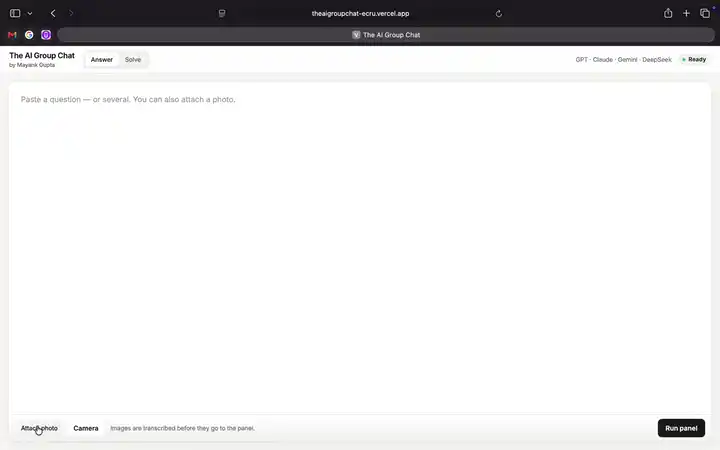
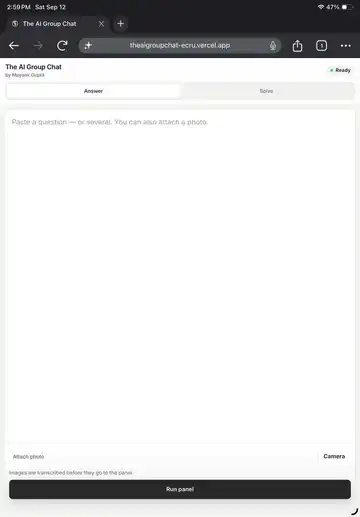
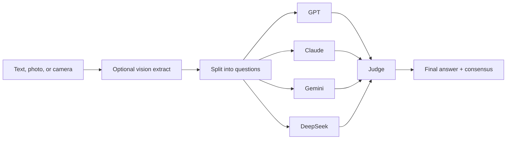

# The AI Group Chat

**Four models argue. A judge decides. You get the answer.**

Paste a question, snap a photo of a paper, or drop in a whole set of MCQs. GPT, Claude, Gemini, and DeepSeek solve it in parallel. A separate judge then works the problem **independently**, treats the panel as evidence (not truth), and returns a final answer or `SKIP` when it cannot be sure.

Built for exam questions, technical problems, and anything where one model’s confidence is not enough.

## Demo

GitHub README files cannot play `.mp4` inline, so these are looping previews. The full recordings are in [`docs/demo/`](docs/demo).

**Desktop — Solve mode.** Paste a problem, watch the panel reason, then read the judge’s worked solution.

<p align="center">
  
</p>

**Mobile — MCQ.** Run an MCQ on a phone: question, four models, consensus, and the final answer.

<p align="center">
  
</p>

---

## Why this exists

A single LLM will often sound certain and still be wrong. Majority vote is not a fix either four models can share the same mistake.

This app is a **deliberation loop**, not a chatbot:

1. **Panel** — four different providers answer the same question at the same time.
2. **Consensus** — votes are counted so you can *see* disagreement, not hide it.
3. **Judge** — solves the question from scratch, then uses panel answers only as supporting evidence. Majority does not win by default. One well-reasoned minority can beat three confident errors.
4. **Honesty** — incomplete, unreadable, or unsolvable questions get `SKIP` instead of a guess.

---

## What it can do

| Capability | Detail |
| --- | --- |
| **Four-model panel** | `GPT-4o-mini`, `Claude Haiku 4.5`, `Gemini 2.5 Flash`, `DeepSeek Chat` via [OpenRouter](https://openrouter.ai) |
| **Independent judge** | Separate GPT-4o-mini pass; verifies math, options, units, and logic |
| **Answer mode** | Fast final answer + a one line reason |
| **Solve mode** | Full step by step solutions with LaTeX |
| **Photo → question** | Vision transcription of exam pages (JPG, PNG, WEBP, GIF, ≤ 4 MB) |
| **Live camera** | Capture a question from your phone or webcam |
| **Batch papers** | Splits numbered/ multi-question text (up to 5 per run) |
| **Math rendering** | KaTeX for `$...$`, `$$...$$`, and common LaTeX commands |
| **Question types** | Single correct MCQ, multi correct, numerical, integer, T/F, short answer, multi-step |

---

## How a round works



- Panel calls run **concurrently** (`asyncio.gather`), with per model timeouts so one slow provider cannot stall the round.
- The judge is instructed **not** to pick the popular answer. It re solves first.
- If the judge fails but **3+ models agree**, that vote is used as a fallback and labelled as such.
- If nobody produces a usable answer, the UI says so instead of inventing one.

---

## Stack

| Layer | Choice |
| --- | --- |
| Backend | Flask 3, Python 3.12 |
| Model access | OpenAI-compatible async client → OpenRouter |
| Frontend | Vanilla JS, Inter, KaTeX |
| Deploy | Vercel (`vercel.json`)|

No frontend framework. No database. One process, one key, one page.

---

## Quick start

```bash
git clone https://github.com/Mayankgupta1754/theaigroupchat
cd project
python3 -m venv .venv
source .venv/bin/activate   # Windows: .venv\Scripts\activate
pip install -r requirements.txt
```

Create a `.env` in the project root:

```bash
OPENROUTER_API_KEY=sk-or-...
APP_URL=http://localhost:5000
```

Run it:

```bash
python app.py
```

Open [http://localhost:5000](http://localhost:5000). Paste a question (or attach a photo) and hit **Run panel**.
---

## Using the app

1. Choose **Answer** (short) or **Solve** (worked solution).
2. Paste text, attach an image, or use **Camera**.
3. Photos are transcribed **before** they go to the panel you can edit the text if OCR missed a sign or option.
4. Watch four “Working…” cards fill in as each model returns.
5. Read the **consensus** box: final answer, vote split (`agree / total`), and the judge’s reason or full solution.
6. If you pasted several questions, use the **Q1 / Q2 / …** tabs.

---

## API

| Method | Path | Purpose |
| --- | --- | --- |
| `GET` | `/` | UI |
| `GET` | `/health` | `{ "ok": true, "app": "the-ai-group-chat" }` |
| `POST` | `/api/parse-image` | Multipart `image` → `{ "question": "..." }` |
| `POST` | `/api/solve` | JSON `{ "question", "mode" }` or multipart with optional `image` |

`mode` is `"answer"` (default) or `"solve"`.

Example:

```bash
curl -s http://localhost:5000/api/solve \
  -H "Content-Type: application/json" \
  -d '{"question":"If 2x + 3 = 11, what is x? A) 3 B) 4 C) 5 D) 6","mode":"answer"}'
```

The response includes per-model answers and timings, vote counts, judge status, and `final_answer`.

---

## Design choices worth noticing

- **Temperature 0** on every call — this is a solver, not a brainstorm.
- **Canonical answers** — MCQ letters are normalized (`A,C` vs `C, A`), `SKIP` tokens are recognized, long rambling “answers” are trimmed.
- **Local split first** — numbered questions and `<<<Q>>>` separators are parsed without an extra LLM call; the splitter model only runs when the text *looks* like a paper but local rules are unsure.
- **Shared context is copied** into each extracted question so passage-based items stay self-contained.
- **Vision is transcription-only** — the extract prompt forbids solving, rewriting, or “fixing” the paper.

---

## Project layout

```
.
├── app.py
├── templates/index.html
├── static/style.css
├── static/script.js
├── docs/demo/          # PC Solve + mobile MCQ recordings
├── requirements.txt
├── runtime.txt
└── vercel.json
```

---

## Environment

| Variable | Required | Notes |
| --- | --- | --- |
| `OPENROUTER_API_KEY` | Yes | OpenRouter key with access to the four panel models |
| `APP_URL` | No | Sent as `HTTP-Referer` (defaults to `http://localhost:5000`) |
| `PORT` | No | Defaults to `5000` |
| `FLASK_DEBUG` | No | Set to `1` for Flask debug |

Keep `.env` out of git (already gitignored).

---

## Limits (intentional)

- Max **5** questions per run  
- Max **~16k** characters of question text  
- Images **under 4 MB**  
- Panel timeout **25s** (answer) / **50s** (solve)  
- Judge timeout **20s** / **45s**

These keep a round snappy and costs predictable.

---

## Credits

**The AI Group Chat** — by Mayank Gupta.

Models are accessed through OpenRouter. You are responsible for your own API usage and for not submitting content you are not allowed to process.
